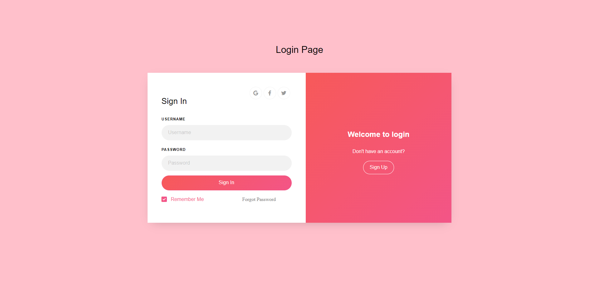
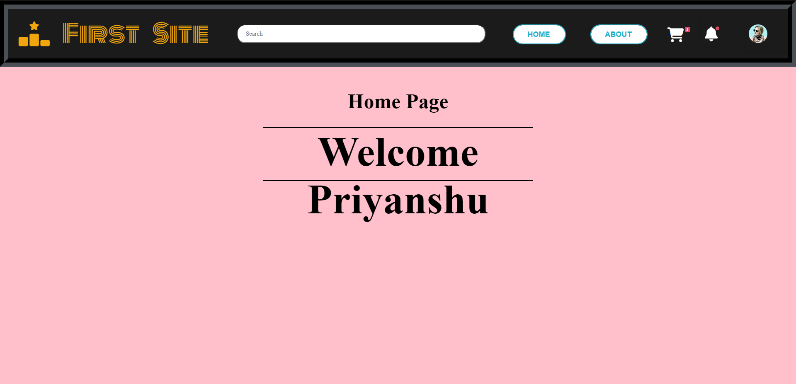

# Starter Boilerplate for any Website..!!

 

## Introduction (❁´◡`❁):

This project is basically made by me in order to know how things gonna work in real world in already implemented websites, like how backend is connected to frontend or how to maintain any data stored in the database, etc. Now for this, I have started with the most used frontend and backend frameworks specially used in Full Stack Development, i.e. **_MERN Stack_**, abbreviated as **M**ongoDb **E**xpress **R**eact and **N**ode. 

In this instead of installing MongoDB in my local machine, I have used even better option of using [MongoDB atlas](https://www.mongodb.com/atlas/database) which doesn't require any installation as it works online.

And for sending mail for **Forgot Password button**, I have used one of the most popular mail api provider i.e. [EmailJS](https://www.emailjs.com/) from which you can send upto 200 mails per month for free. In this you can even make your desired template, like how the mail gonna look like, very easily. And the interesting part is that, in react we have already have a library for this which makes life easier as it removes all that setup part needed for sending mail (like any other provider does). Just invoke `emailjs.send()` command by passing that API keys and all and that's it, your mail have been sent to the respected mail id which you passed in it.

---

## Demo 👀

You can view the demo of this website by following [this link](https://boilerplate-for-websites.netlify.app/). Although I have also provided the screenshots below of exactly how it looks like.  For hosting, I have used [Netlify](https://app.netlify.com) to host this website.

Here is the ss of the website

---

## ✅ Steps to start with:

### Firstly ensure that you are ready with these things:

- Node installed in your system (check it by running either `node -v` or `npm -v` in your terminal)
- URI String for MongoDB Atlas connection [from here](https://cloud.mongodb.com/v2/63c0084fb7eec9687474067f#/clusters/detail/Cluster-1/connect?clusterId=Cluster-1).
- EmailJs [Service_ID](https://dashboard.emailjs.com/admin), [Template_ID](https://dashboard.emailjs.com/admin/templates) and [API_Key](https://dashboard.emailjs.com/admin/account) for the same.

### After that:

1. Now clone this repo and navigate to the cloned folder.
   > git clone https://github.com/priyanshu-baran/Boilerplate_For_Websites.git && cd Boilerplate_For_Websites
2. Open that cloned folder in VS Code and before moving further, simply open two terminals one with `frontend` folder and other with `backend` folder.
3. Install all the dependencies needed for this project by running this command (in both terminals seperately).
   > npm install
4. Then do the required changes needed before running it, like replacing all the stuffs that you have, with mine one. For this you can simply create one `.env` file inside the backend folder and add all that stuffs right inside it with appropriate name.
   > **_Note:_** I have already defined these terms so be-careful so that you use that names only or else change in all places wherever it is used according to your wish.
5. Now, since all refactoring part is done so let's move ahead by running this command, again in both the terminals seperately.
   > npm start
6. If both of your terminals runs smoothly without showing any error, then congrats 🥳🎉 you are in good state, else re-config your setup and try again 🤕🫣.
7. You can also host it by changing the details with yours on Netlify. I have already provided the netlify.toml file which is required to host on Netlify. You simply need to create an account on Netlify and then select import project from github and select this repo after forking it in yours.
   > **_Note:_** Don't forget to change the **react_url** defined in the frontend/src/index.js file according to your hosted link and then share it to test it out.

---

## How to tweak this project for your own uses

Since this is an example project, I'd encourage you to clone and rename this project to use for your own purposes. It's a good starter boilerplate.

---

## Contributing 📝

If you would like to contribute to this repo `Boilerplate_For_Websites` then, please fork the repository and submit a pull request with your changes. Contributions are welcome and encouraged!

---

## Known issues (Work in progress... 👷🏽‍♂️⚒️)

This project is still ongoing and it currently have some bugs in the **Forgot Password button**, i.e. inside the `Model.js` file. Although I have provided a glimpse of it inside `Model_test.js` file, so you can have a look at it by using it. But then you might encounter an error regarding _password validation_ and somewhat similar to that which will get fixed soon...✍️📝 So have patience and till then do whatever you like after cloning/forking this repo.

---

## Like this project? 🤩

If you are feeling generous, buy me a coffee...!!! ☕ 

---

### Happy Coding...!! 👨🏽‍💻👨🏽‍💻
